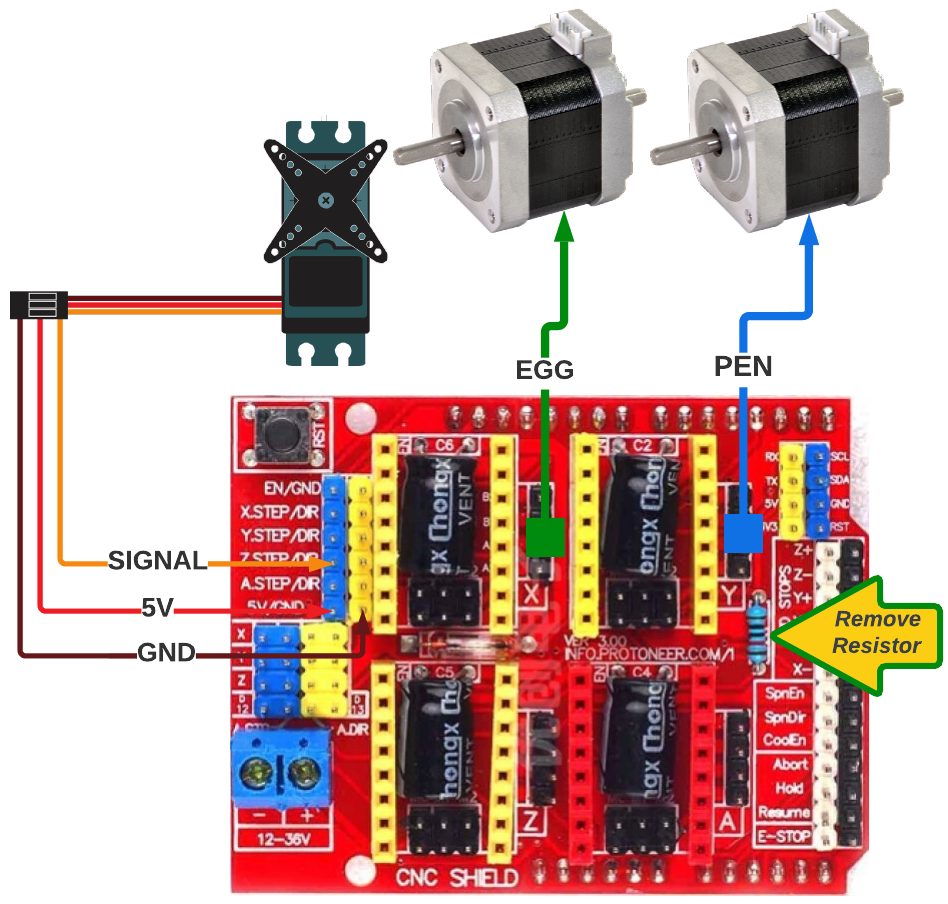
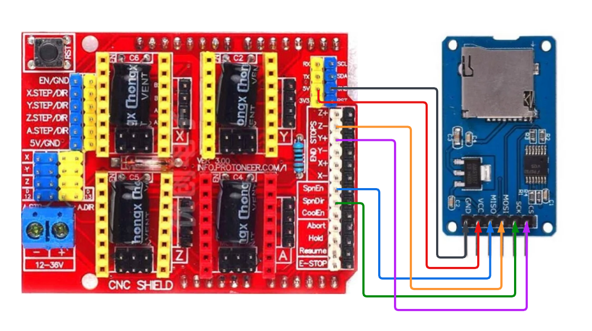

# Wemos D1 R32 + Arduino CNC Shield

The Wemos D1 R32 is an ESP32 board in and Arduino Uno form factor. This enables us to use the very common Arduino CNC shield v3 to drive our EggBots. Since this shield doesn't include an SD card slot, we will have to attach one via the available header pins.

## Hardware Connections

### Servo and Motor Connections

The servo connection will use pins from the left side of the CNC shield. Its easiest to just remove the signal line (yellow) from the 3 pin dupont connector of the servo leaving the other 2 in place. Proceed to attach the servo as shown below.

The stepper motors should be attached to the `X` and `Y` sockets. Please configure the stepper driver jumpers per your driver manufacturer's instructions.

**NOTE:** _For the CNC shield to work with an ESP32 compatible board, you **MUST REMOVE** the resistor shown in the image below. Failure to do so will prevent your controller from booting and may cause damage. You can either de-solder it or cut it out from the top._

| CNC Shield Pins | Servo  |
|-----------------|--------|
| Z-Step (Blue    | Signal |
| 5V (Blue)       | 5V     |
| GND (Yellow)    | GND    |

### SD Card to CNC Shield

**Note:** _Please refer to your SD card adapter's instructions to determine the required VCC voltage. Some adapters provided 3.3vdc directly to the SD card and others have a voltage regulator that requires a 5vdc connection. Both voltages can be sourced from the same header on the CNC shield._

| CNC Shield Pins | SD Card Adapter |
|-----------------|-----------------|
| Y+/Y- End Stop  | CS              |
| SpinDir         | SCK             |
| Z+/Z- End Stop  | MOSI            |
| SpinEnable      | MISO            |
| 5V or 3.3V      | VCC             |
| GND             | GND             |

