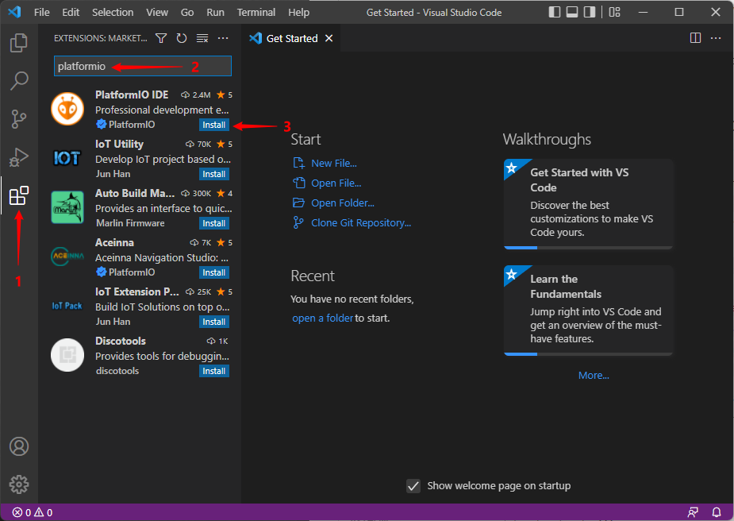
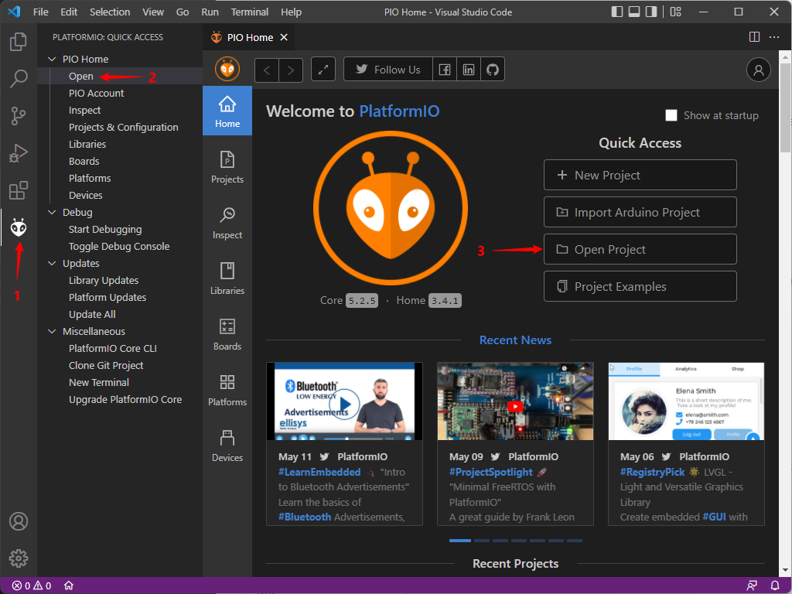
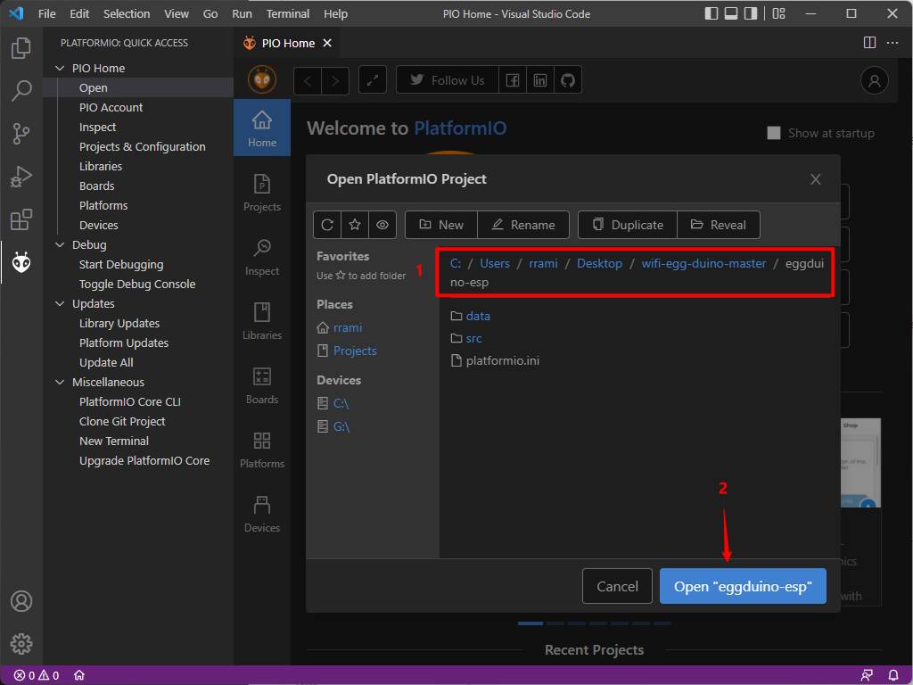
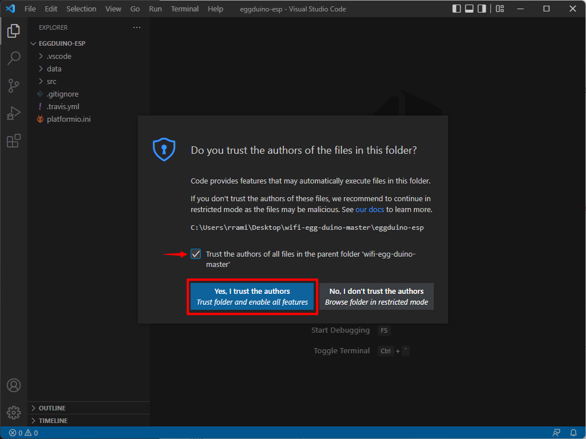
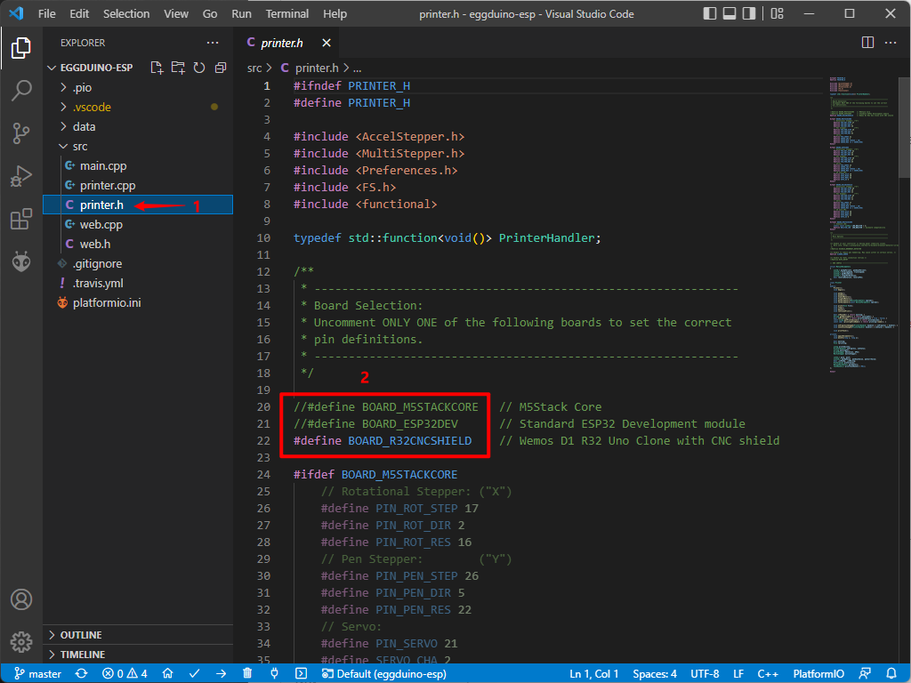
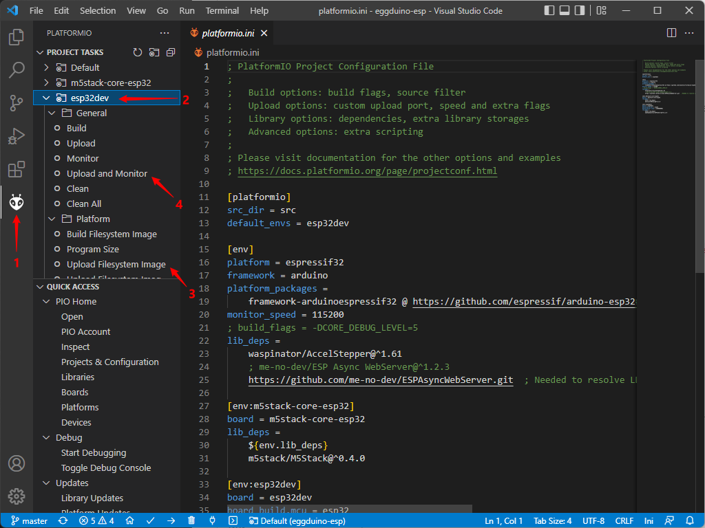

# PlatformIO Build

This guide walks through the process of setting up PlatformIO and configuring it to build and upload the firmware for your Eggbot.

## Process

1. Install VScode for your given operating system

1. Open VScode and install the PlatformIO IDE extension

    - Click on the Extensions icon in the left hand toolbar
    - Type "platformio" in the search bar
    - Click on the blue `Install` button and wait for it to complete

1. Download _(and unzip)_ or clone this repository to your local computer by clicking the green `Code` button at the top of this github repo page

1. Open the PlatformIO project

    - Open the PlatformIO extension by clicking on the new icon in the the left hand toolbar
    - Click on `Open` to open the PlatformIO IDE in the main window
    - Click on `Open Project`

1. Navigate to your downloaded (unzipped) or cloned repo directory

    - Your path will be dependant on your particular setup
    - Click `Open`

1. Trust the authors in the next dialog or you will not be able to build and upload in the next steps


1. Modify the "printer.h" file (if needed) to select the correct board. If your particular board/config is not listed, you can add a new pin mapping as needed

    - Select the "printer.h" file
    - Choose your board by removing the preceding 2 forward slashes (//) to uncomment and adding 2 forward slashes to the invalid entry. If a pin definition does not match your board, you can define a new one by copying the example into your printer.h either above or below the existing definitions.

        **NOTE:** _Only 1 board should be "uncommented". If more than 1 is uncommented, your build may fail._

        **Example Custom Pin Definition:**

        ``` C++
        #define MY_CUSTOM_BOARD  // My Custom Pin Definition

        #ifdef MY_CUSTOM_BOARD
            // Egg Rotation Stepper: ("X")
            #define PIN_ROT_STEP 32
            #define PIN_ROT_DIR 33
            #define PIN_ROT_RES 25
            // Pen Stepper:          ("Y")
            #define PIN_PEN_STEP 26
            #define PIN_PEN_DIR 27
            #define PIN_PEN_RES 25
            // Servo:
            #define PIN_SERVO 14
            #define SERVO_CHA 2                // Do not change
            #define SERVO_MIN (65536 / 20)     // Do not change
            #define SERVO_MAX (2 * SERVO_MIN)  // Do not change
            // SD Card SPI:
            #define VSPI_SCLK 18
            #define VSPI_MISO 19
            #define VSPI_MOSI 23
            #define VSPI_SS 4
        # endif
        ```

    - **_Do not forget to save your changes!_**

1. Build and upload the firmware to your controller

    - Open the PlatformIO extension by clicking on the new icon in the the left hand toolbar
    - Expand the project task that corresponds to the build environment based on your board. **NOTE:** _Ensure your board is plugged into your computer at this time. Driver installation should have been completed beforehand._
    - Click `Upload Filesystem Image` to upload the web client filesystem image
    - Click `Upload and Monitor` to build and upload the firmware. After the upload is complete, the serial monitor will load and you will be able to see whatever console messages the firmware generates, sometimes useful to troubleshoot.
